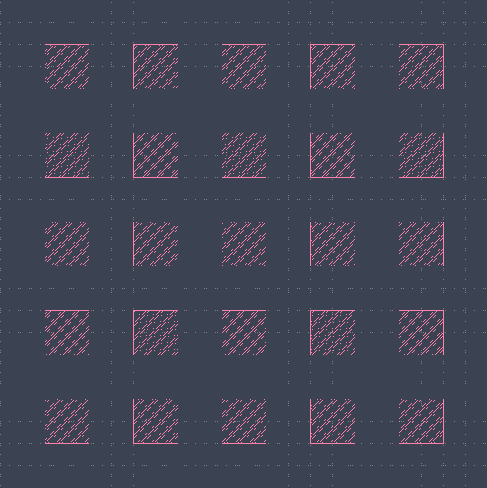

# GDSR

[](https://codecov.io/gh/MatthewMckee4/gdsr)

GDSII manipulation, written in rust.

> [!WARNING]
> This is a work in progress and is not yet ready for production use.

gdsr is currently being repurposed to being a rust crate at the core. Python bindings will be added back in the future.

## Inspiration

My main inspiration comes from [gdstk](https://github.com/heitzmann/gdstk).
If you are looking for an extremely fast gds manipulation python package
then i would strongly recommend heading over and having a look at his work.

Other inspirations include:

- [gdsfactory](https://github.com/gdsfactory/gdsfactory)
- [klayout](https://www.klayout.org/klayout-pypi/)

## Getting Started

A simple program below shows the easy to use interface.

```rust
use gdsr::{Cell, Grid, Library, Point, Polygon, Reference};

fn main() {
    let units = 1e-9;

    let mut library = Library::new("main");

    let mut cell = Cell::new("main_cell");

    let polygon = Polygon::new(
        [
            Point::integer(0, 0, units),
            Point::integer(1, 0, units),
            Point::integer(1, 1, units),
            Point::integer(0, 1, units),
        ],
        1,
        0,
    );

    let reference = Reference::new(
        polygon,
        Grid::new(
            Point::integer(0, 0, units),
            5,
            5,
            Point::integer(2, 0, units),
            Point::integer(0, 2, units),
            1.0,
            0.0,
            false,
        ),
    );

    cell.add(reference);

    library.add(cell);

    library.write_file("main.gds", 1e-9, 1e-9).unwrap();
}
```

This gives us the following GDS file:



## Documentation

seal's documentation is available at [matthewmckee4.github.io/gdsr](https://matthewmckee4.github.io/gdsr/)

## Need help?

Head over to the [discussions page](https://github.com/MatthewMckee4/gdsr/discussions)
and create a new discussion there or have a look at the [issues page](https://github.com/MatthewMckee4/gdsr/issues) to see if anyone has had the same issue as you.

## Contributing

Contributions are welcome! Please see the [contributing guide](CONTRIBUTING.md) for more information.

## License

gdsr is licensed under the MIT License.
